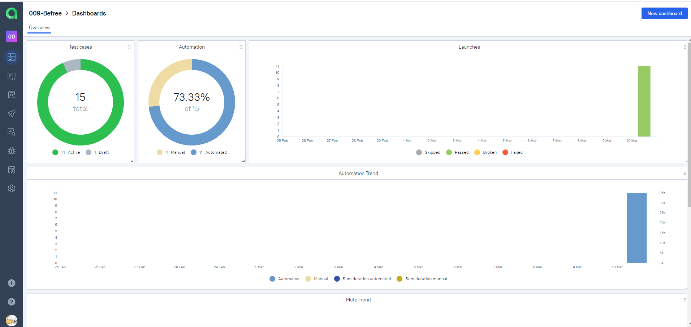
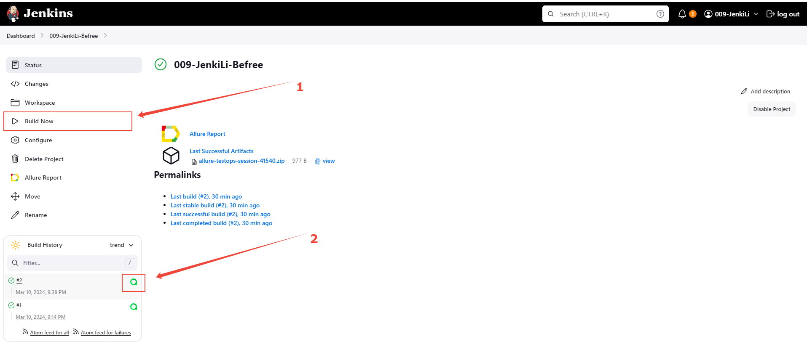

<h1 align="center">Проект по тестированию интернет-магазина <a href="https://befree.ru/"> Befree </a> </h1>


### Стек: Python, Selene, Pytest, Jenkins, Selenoid, Allure-report
<p align="left">


</p>

---

### Автотестами проверяется:
web
- 
- Добавление товара в корзину  
- Удаление товара из корзины
- Поиск товара по названию  
- Поиск товара по артикулу  
- Добавление товара в избранное


api
- 
- Добавление товара в корзину
- Удаление товара из корзины
- Добавление товара в избранное
- Авторизация
- Получение информации о товарах в корзине


mobile
-
- Авторизация


Пример выполнения теста

<p align="left">
  


</p>


---

Отчёт о прохождении будет сгенерирован в Allure TestOps с подробными шагами, скриншотами, видео.
Также, при необходимости можно подключить уведомления в Telegram, skype, discord, slack  


  
  


---


### Как запустить  
###### Удаленно

1. Открыть <a href="https://jenkins.autotests.cloud/job/009-JenkiLi-Befree/"> jenkins-control  </a>
2. Нажать Build now
3. Дождаться завершения 
4. Перейти в allure отчет  

  

###### Локально

1. Клонируйте репозиторий
```ruby
git clone https://github.com/AlikGallyamov/Befree.git
```
2. Создайте и активируйте виртуальное окружение
  ```ruby
  python -m venv .venv
  cd Wildberries
  .venv\Scripts\activate
  ```
3. Установите зависимости с помощью pip
  ```ruby
  pip install -r requirements.txt
  ```
4. Запустите автотесты 
  ```ruby
  pytest tests --next local_emulator
  ```
5. Получите отчёт allure
```ruby
allure serve allure-results
``` 


