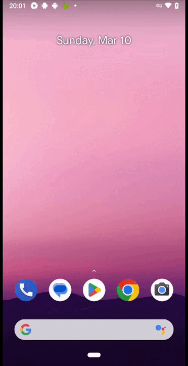
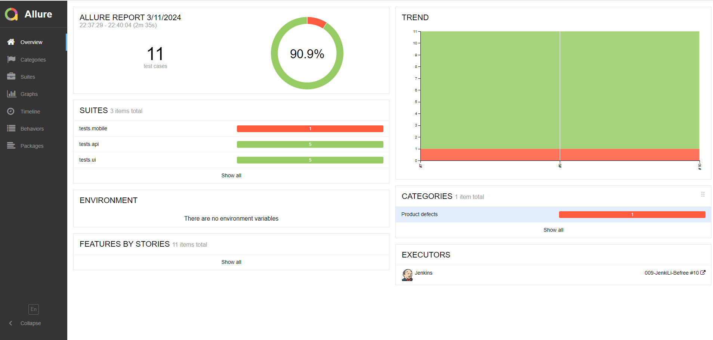
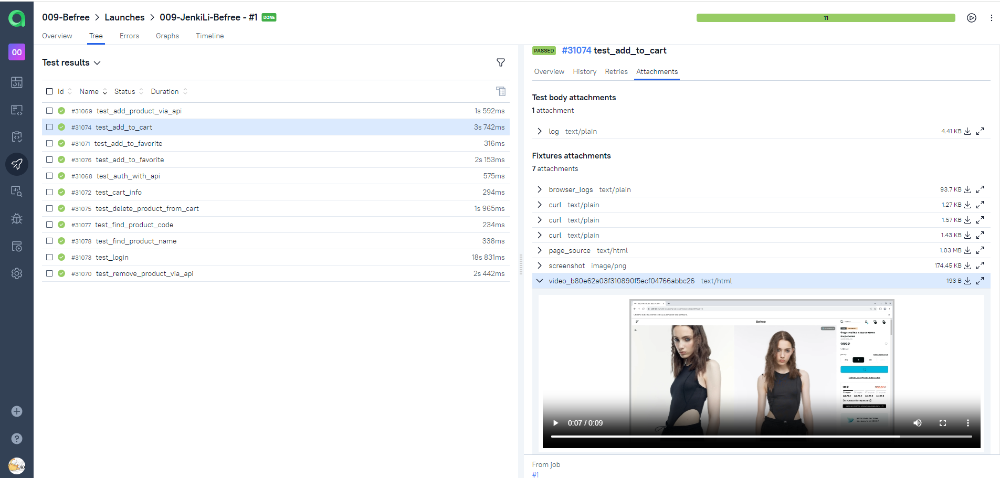

<h1 align="center">Проект по тестированию интернет-магазина <a href="https://befree.ru/"> Befree </a> </h1>

### Стек: Python, Selene, Pytest, Jenkins, Selenoid, Allure-report

<p align="left">


</p>

---

### Автотестами проверяется:

web
- 

- Добавление товара в корзину
- Удаление товара из корзины
- Поиск товара по названию
- Поиск товара по артикулу
- Добавление товара в избранное

api
- 

- Добавление товара в корзину
- Удаление товара из корзины
- Добавление товара в избранное
- Авторизация
- Получение информации о товарах в корзине

mobile
-

- Авторизация

Пример выполнения теста

<p align="left">
  


</p>


---

Отчёт о прохождении будет сгенерирован в Allure


    

---

Также настроена интеграция с Allure TestOps с подробными шагами, скриншотами, видео. При необходимости можно подключить уведомления в Telegram, skype, discord, slack

    


---

### Как запустить

###### Удаленно

1. Открыть <a href="https://jenkins.autotests.cloud/job/009-JenkiLi-Befree/"> jenkins  </a>
2. Нажать Build now
3. Дождаться завершения
4. Перейти в allure отчет

  

###### Локально

1. Клонируйте репозиторий


2. Создайте и активируйте виртуальное окружение

  ```ruby
python -m venv .venv
source .venv/bin/activate
  ```

3. Установите зависимости с помощью pip

  ```ruby
  pip install -r requirements.txt
  ```

4. Запустите автотесты

  ```ruby
  pytest tests --next local_emulator
  ```

5. Получите отчёт allure

```ruby
allure serve allure-results
``` 


